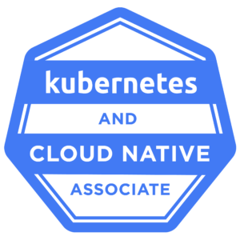
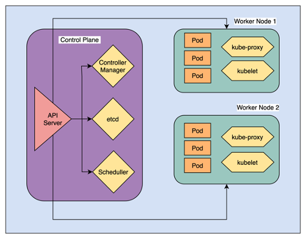

# Kubernetes-and-Cloud-Native-Associate KCNA

  

- Note: A documentation of notes & useful resources used to prepare for the KCNA. Feel free to share them :)

## Exam Brief

- Duration : 1.5 hours
<!-- Number of questions : ??? Multiple choice questions -->
- Passing score: 75%
- Certification validity: 3 years
- Prerequisite: None
- Cost: $250 USD, 1 year exam eligibility, with a free retake within the year.
- [Official KCNA curriculum](https://github.com/cncf/curriculum/blob/master/KCNA_Curriculum.pdf)

  *Linux Foundation offer several discounts around the year such as CyberMonday, Kubecon and various other events - ensure to utilise these*

## KCNA topics overview

- [X] [Kubernetes Fundamentals - 46%](#small_blue_diamond-1-kubernetes-fundamentals---46)
- [X] [Container Orchestration - 22%](#Container-orchestration---22)
- [X] [Cloud Native Architecture - 16%](#cloud-native-architecture---16)
- [X] [Cloud Native Observability - 8%](#cloud-native-observability---8)
- [X] [Cloud Native Application Delivery - 8%](#cloud-native-application-delivery---8)

## [Practice questions](./mock-exam-questions/questions.md)

#### Extra helpful materials

- [x] [Slack](#slack)
- [x] [Books](#books)
- [x] [Youtube Videos](#useful-youtube-videos)

### Useful keys & Common accronyms in Kubernetes

- K8s = Kubernetes
- CNCF = Cloud Native Computing Foundation
- NetPol = Network Policies
- PV = Persistent Volumes
- PVC = Persistent Volume Claims

## :small_blue_diamond: 1. Kubernetes Fundamentals - 46%

### 1.1 Fundamental Kuberenetes resources

- [Pods in Kubernetes](https://kubernetes.io/docs/concepts/workloads/pods/)

Pods in K8s

 

Pods are the smallest deployable units of computing that you can create and manage in Kubernetes.

- [Deployments in Kubernetes](https://kubernetes.io/docs/concepts/workloads/controllers/deployment/)

Deployments in K8s

 

A Deployment provides declarative updates for Pods and ReplicaSets.

You describe a desired state in a Deployment, and the Deployment Controller changes the actual state to the desired state at a controlled rate. You can define Deployments to create new ReplicaSets, or to remove existing Deployments and adopt all their resources with new Deployments.

- [Services in Kubernetes](https://kubernetes.io/docs/concepts/services-networking/service/)

Services in K8s

 

An abstract way to expose an application running on a set of Pods as a network service.

- [ReplicaSets in Kubernetes](https://kubernetes.io/docs/concepts/workloads/controllers/replicaset/)

ReplicaSets in K8s

 

A ReplicaSet's purpose is to maintain a stable set of replica Pods running at any given time. As such, it is often used to guarantee the availability of a specified number of identical Pods.

### 1.2 Kubernetes Architecture

  

- [Kubernetes Componenent](https://kubernetes.io/docs/concepts/overview/components/)

- [Nodes in K8s](https://kubernetes.io/docs/concepts/architecture/nodes/)
- [Control Plane-Node Communication](https://kubernetes.io/docs/concepts/architecture/control-plane-node-communication/)

### 1.3 Kubernetes API

- [The Kubernetes API](https://kubernetes.io/docs/concepts/overview/kubernetes-api/)
- [Kubernetes API server](https://kubernetes.io/docs/reference/command-line-tools-reference/kube-apiserver/)

### 1.4 Containers

  

- [What are Containers?](https://kubernetes.io/docs/concepts/containers/)
- [Containers](https://www.docker.com/resources/what-container)
- [Docker Tutorial for Beginners](https://www.youtube.com/watch?v=fqMOX6JJhGo) (OPTIONAL)
- [Best practices for creating Dockerfiles](https://www.youtube.com/watch?v=JofsaZ3H1qM)
- [Containers vs VMS](https://www.youtube.com/watch?v=cjXI-yxqGTI)
- [Container Images](https://kubernetes.io/docs/concepts/containers/images/)

### 1.5 Scheduling

- [The Kubernetes Scheduler](https://kubernetes.io/docs/concepts/scheduling-eviction/kube-scheduler/)
- [Assigning Pods to Nodes](https://kubernetes.io/docs/concepts/scheduling-eviction/assign-pod-node/)
- [Scheduling framework](https://kubernetes.io/docs/concepts/scheduling-eviction/scheduling-framework/)
- [How the K8s scheduler works](https://www.youtube.com/watch?v=rDCWxkvPlAw)

## :small_blue_diamond: 2. Container Orchestration - 22%

### 2.1 Containers Orchestration Fundamentals

- [What is Kubernetes?](https://kubernetes.io/docs/concepts/overview/what-is-kubernetes/)
- [Container Orchestration Explained](https://www.youtube.com/watch?v=kBF6Bvth0zw)

### 2.2 Runtime

- [Container runtimes](https://kubernetes.io/docs/setup/production-environment/container-runtimes/)
- [Making Sense of the Container Runtime Landscape in Kubernetes](https://www.youtube.com/watch?v=RyXL1zOa8Bw)
- [Container Runtime Interface (CRI)](https://kubernetes.io/docs/concepts/architecture/cri/)
- [What are Runtime Classes?](https://kubernetes.io/docs/concepts/containers/runtime-class/)
- [Kubernetes is deprecating Docker as a container runtime after v1.20](https://kubernetes.io/blog/2020/12/02/dont-panic-kubernetes-and-docker/)
- [Kubernetes is deprecating Docker: what you need to know](https://acloudguru.com/blog/engineering/kubernetes-is-deprecating-docker-what-you-need-to-know)

### 2.3 Security

- [The 4C's of Cloud Native Security](https://kubernetes.io/docs/concepts/security/overview/)

  

- [Securing a cluster](https://kubernetes.io/docs/tasks/administer-cluster/securing-a-cluster/)
- [Cloud native security guide for building secure applications](https://snyk.io/learn/cloud-native-security-for-cloud-native-applications/)
- [Kubernetes Security Best Practices: 10 Steps to Securing K8s](https://www.aquasec.com/cloud-native-academy/kubernetes-in-production/kubernetes-security-best-practices-10-steps-to-securing-k8s/)
- [Kubernetes Security Cheat Sheet](https://cheatsheetseries.owasp.org/cheatsheets/Kubernetes_Security_Cheat_Sheet.html)
- [Kubernetes Security: Common Issues and Best Practices](https://snyk.io/learn/kubernetes-security/)
- [What is Kubernetes Container Security?](https://www.trendmicro.com/en_gb/what-is/container-security/kubernetes.html)
- [Kubernetes Security 101: Fundamentals and Best Practices](https://sysdig.com/learn-cloud-native/kubernetes-security/kubernetes-security-101/)
- [Understand Role Based Access Control (RBAC) in Kubernetes](https://www.youtube.com/watch?v=G3R24JSlGjY)
- [Controlling access to the K8s API](https://kubernetes.io/docs/concepts/security/controlling-access/)

### 2.4 Networking

- [Cluster networking in K8s](https://kubernetes.io/docs/concepts/cluster-administration/networking/)
- [Network Policies in K8s](https://kubernetes.io/docs/concepts/services-networking/network-policies/)
- [Services, Load Balancing and Networking](https://kubernetes.io/docs/concepts/services-networking/)
- [Container Networking From Scratch](https://www.youtube.com/watch?v=6v_BDHIgOY8)

### 2.5 Service Mesh

- [What's a service mesh? (REDHAT)](https://www.redhat.com/en/topics/microservices/what-is-a-service-mesh)
- [What Is a Service Mesh? (NGINX)](https://www.nginx.com/blog/what-is-a-service-mesh/)
- [The Istio service mesh](https://istio.io/latest/about/service-mesh/)
- [Istio & Service Mesh - simply explained in 15 mins](https://www.youtube.com/watch?v=16fgzklcF7Y)
- [Managing microservice with Istio service mesh](https://kubernetes.io/blog/2017/05/managing-microservices-with-istio-service-mesh/)

### 2.6 Storage

- [Storage in Kubernetes](https://kubernetes.io/docs/concepts/storage/)
- [What is Kubernetes Storage?](https://cloud.netapp.com/blog/cvo-blg-kubernetes-storage-an-in-depth-look)
- [Kubernetes Storage 101: Concepts and Best Practices](https://cloudian.com/guides/kubernetes-storage/kubernetes-storage-101-concepts-and-best-practices/)
- [Volumes in Kubernetes](https://kubernetes.io/docs/concepts/storage/volumes/)
- [Persistent Volumes aka PVs in K8s](https://kubernetes.io/docs/concepts/storage/persistent-volumes/)
- [Why Is Storage On Kubernetes So Hard?](https://softwareengineeringdaily.com/2019/01/11/why-is-storage-on-kubernetes-is-so-hard/)
- [A complete storage guide for your Kubernetes storage problems by CNCF](https://www.cncf.io/blog/2020/04/28/a-complete-storage-guide-for-your-kubernetes-storage-problems/)
- [To run or not to run a database on Kubernetes: What to consider](https://cloud.google.com/blog/products/databases/to-run-or-not-to-run-a-database-on-kubernetes-what-to-consider)
- [Kubernetes And Databases](https://www.magalix.com/blog/kubernetes-and-database)

## :small_blue_diamond: 3. Cloud Native Architecture - 16%

- [The Cloud Native Glossary](https://github.com/cncf/glossary/blob/main/cloudnative-glossary.pdf)
- [CNCF Cloud Native Interactive Landscape](https://landscape.cncf.io/)
- [The beginners guide to the CNCF landscape](https://www.cncf.io/blog/2018/11/05/beginners-guide-cncf-landscape/)
- [Graduated and incubaring projects in the CNCF eco-system](https://www.cncf.io/projects/)
- [Cloud Native Architecture Fundamentals](https://medium.com/walmartglobaltech/cloud-native-architecture-fundamentals-ac13f979916d)
- [Introduction to Monolithic Architecture and MicroServices Architecture](https://medium.com/koderlabs/introduction-to-monolithic-architecture-and-microservices-architecture-b211a5955c63)
- [Microservices Architecture](https://docs.microsoft.com/en-us/azure/architecture/guide/architecture-styles/microservices)
- [Managing microservice with Istio service mesh](https://kubernetes.io/blog/2017/05/managing-microservices-with-istio-service-mesh/)
- [What is microservices architecture?](https://cloud.google.com/learn/what-is-microservices-architecture)
- [Microservices vs Monolithic Architecture](https://www.mulesoft.com/resources/api/microservices-vs-monolithic)

### 3.1 Autoscaling

- [Autoscaling in Kubernetes](https://kubernetes.io/blog/2016/07/autoscaling-in-kubernetes/)
- [Horizontal Pod Autoscaling (HPA in K8s)](https://kubernetes.io/docs/tasks/run-application/horizontal-pod-autoscale/)
- [Kubernetes Autoscaling: 3 Methods and How to Make Them Great](https://spot.io/resources/kubernetes-autoscaling-3-methods-and-how-to-make-them-great/)
- [Kubernetes Autoscaling in Production: Best Practices for Cluster Autoscaler, HPA and VPA](https://www.replex.io/blog/kubernetes-in-production-best-practices-for-cluster-autoscaler-hpa-and-vpa)
- [Horizontal Pod autoscaling in GKE (GCP)](https://cloud.google.com/kubernetes-engine/docs/concepts/horizontalpodautoscaler)

### 3.2 Serverless

- [Microservices vs. Serverless Architecture](https://www.sumologic.com/blog/microservices-vs-serverless-architecture/)
- [Serverless Functions as a Service for Kubernetes](https://kubernetes.io/blog/2017/01/fission-serverless-functions-as-service-for-kubernetes/)
- [Serverless containers on K8s](https://knative.dev/docs/)
- [Knative GitHub](https://github.com/knative)

### 3.3 Community & Governance

- [Community & Governance in K8s (K8s GitHub)](https://github.com/kubernetes/community/blob/master/governance.md)
- [The Kubernetes Community](https://kubernetes.io/community/)
- [The Official Kuberenetes GitHub](https://github.com/kubernetes/kubernetes)
- [Kubernetes governance, what you should know](https://www.cncf.io/blog/2020/05/29/kubernetes-governance-what-you-should-know/)
- [Kubernetes Community Values](https://kubernetes.io/community/values/)
- [Kubernetes 1.21: Power to the Community](https://kubernetes.io/blog/2021/04/08/kubernetes-1-21-release-announcement/)
- [Kubernetes in Production: Best Practices for Governance, Cost Management, Security and Access Control](https://www.replex.io/blog/kubernetes-in-production-best-practices-for-governance-cost-management-and-security-and-access-control)

### 3.4 Roles & Personas

- [Personas](https://cluster-api.sigs.k8s.io/user/personas.html)
- [[Podcast] PodCTL #28 - Kubernetes Roles & Personas](https://cloud.redhat.com/blog/podcast-podctl-28-kubernetes-roles-personas)
- [Personas and use cases](https://www.ibm.com/docs/en/cloud-paks/cp-management/1.3.0?topic=about-personas-use-cases)
- [PodCTL - Enterprise Kubernetes - podcast focused on Roles and Personas of K8s environments](https://podctl.buzzsprout.com/110399/653300-kubernetes-roles-personas)

### 3.5 Open Standards

- [Navigating open standards for Kubernetes](https://www.information-age.com/navigating-open-standards-for-kubernetes-123492463/)
- [Open standards can make or break a Kubernetes implementation](https://morioh.com/p/02a05107d000)
- [Three tips to implement Kubernetes with open standards](https://techtelegraph.co.uk/three-tips-to-implement-kubernetes-with-open-standards/)

## :small_blue_diamond: 4. Cloud Native Observability - 8%

### 4.1 Telemetry & Observability

- [What is Telemetry? The Guide to Application Monitoring](https://www.sumologic.com/insight/what-is-telemetry/)
- [Tools for Monitoring Resources](https://kubernetes.io/docs/tasks/debug-application-cluster/resource-usage-monitoring/)
- [What is OpenTelemetry and why is it the future of instrumentation?](https://www.cncf.io/blog/2021/08/06/what-is-opentelemetry-and-why-is-it-the-future-of-instrumentation/)
- [Migrating telemetry and security agents from dockershim](https://kubernetes.io/docs/tasks/administer-cluster/migrating-from-dockershim/migrating-telemetry-and-security-agents/)
- [Getting started with OpenTelemetry on Kubernetes](https://signoz.io/blog/opentelemetry-kubernetes/)
- [CNCF Advances OpenTelemetry Initiative](https://devops.com/cncf-advances-opentelemetry-initiative/)
- [Splunk Donates eBPF Telemetry Data Collector to CNCF](https://devops.com/splunk-donates-ebpf-telemetry-data-collector-to-cncf/)

### 4.2 Prometheus

- [What is Prometheus?](https://prometheus.io/docs/introduction/overview/)
- [An introduction to monitoring with Prometheus](https://opensource.com/article/19/11/introduction-monitoring-prometheus)
- [How Prometheus Monitoring works | Prometheus Architecture explained by Nana Janashia](https://www.youtube.com/watch?v=h4Sl21AKiDg)
- [What is Prometheus and Why Should You Use It?](https://opsani.com/resources/what-is-prometheus-and-why-should-you-use-it/)
- [Metrics For Kubernetes System Components](https://kubernetes.io/docs/concepts/cluster-administration/system-metrics/)

### 4.3 Cost Management

- [Cost management for Kubernetes](https://www.redhat.com/en/technologies/cloud-computing/openshift/cost-management)
- [Kubernetes Cost Analysis: Manage Your Kubernetes Costs](https://harness.io/blog/kubernetes-cost-analysis/)
- [Kubernetes Cost Management and Analysis Guide](https://dev.to/cloudforecast/kubernetes-cost-management-and-analysis-guide-1e1b)

## :small_blue_diamond: 5. Cloud Native Application Delivery - 8%

### 5.1 Application Delivery Fundamentals

- [Continuous delivery at cloud native speed](https://www.weave.works/use-cases/application-delivery/)
- [What is Helm](https://helm.sh/)

### 5.2 GitOps

- [What is GitOps?](https://www.redhat.com/en/topics/devops/what-is-gitops)
- [ArgoCD Kubernetes - YouTube playlist by Just me and Opensource](https://www.youtube.com/playlist?list=PL34sAs7_26wMW4bWKnMIfEd87aPuw75by)
- [ArgoCon 2021 - YouTube playlist](https://www.youtube.com/playlist?list=PLGHfqDpnXFXKwNGO_8usFuTO-rIHNyefC)

### 5.3 CI/CD

- [Kubernetes CICD - CI/CD for Kubernetes | Weaveworks](https://www.weave.works/technologies/ci-cd-for-kubernetes/)
- [Kubernetes for CI/CD at scale](https://platform9.com/blog/kubernetes-for-ci-cd-at-scale/)
- [Kubernetes CI/CD pipelines: What, why, and how](https://ubuntu.com/blog/kubernetes-ci-cd-pipelines-what-why-and-how)
- [Top Open Source CI/CD Tools for Kubernetes to Know](https://cloud.redhat.com/blog/top-open-source-ci/cd-tools-for-kubernetes-to-know)
- [Kubernetes CI/CD Best Practices](https://harness.io/blog/kubernetes-ci-cd-best-practices/)
- [CI/CD Pipelines with Kubernetes | Best Practices and Tools](https://www.containiq.com/post/cicd-pipelines-with-kubernetes)

# [Practice questions - Click this for practice questions (IN PROGRESS)](./mock-exam-questions/questions.md)

## Slack

1. [Kubernetes Community - #kcna-exam-prep](https://kubernetes.slack.com)
1. [Kubernetes Community](https://kubernauts-slack-join.herokuapp.com/)

## Useful training material

- [Kubernetes and Cloud Native Essentials by The Linux Foundation](https://training.linuxfoundation.org/training/kubernetes-and-cloud-native-essentials-lfs250/)
- [Introduction to GitOps by The Linux Foundation](https://training.linuxfoundation.org/training/introduction-to-gitops-lfs169/)

## More reading material

- [Kubernetes: Up and Running by O’Reilly](https://learning.oreilly.com/library/view/kubernetes-up-and/9781491935668/)
- [7 Best Books to Get You Started with Kubernetes](https://blog.turbonomic.com/top-kubernetes-book)

## References

- [The Official Kubernetes Documentation](https://k8s.io/docs)

## Useful Youtube vdeos

- [Kubernetes and Cloud Native Associate (KCNA) exam - Katie Gamanji, CNCF](https://www.youtube.com/watch?v=TtUMT5cnVO4)
- [KCNA breakdown by Saiyam Pathak](https://www.youtube.com/watch?v=iGkFHB1kFZ0)
- [Open Source Values & Advocacy & Deep Dive KCNA Exam | CLOUDNATIVE.FM Ep 31](https://www.youtube.com/watch?v=wPbsvF_SGmc)

## Useful Kubernetes repos + Next steps?

- [Kubernetes Certified Administrator by Walid Shaari](https://github.com/walidshaari/Kubernetes-Certified-Administrator)
- [CKA Exercises](https://github.com/moabukar/CKA-Exercises)
- [CKAD Exercises](https://github.com/dgkanatsios/CKAD-exercises)
- [CKS repo by Walid Shaari](https://github.com/walidshaari/Certified-Kubernetes-Security-Specialist)
- [CKS-Exercises](https://github.com/moabukar/CKS-Exercises-Certified-Kubernetes-Security-Specialist)
